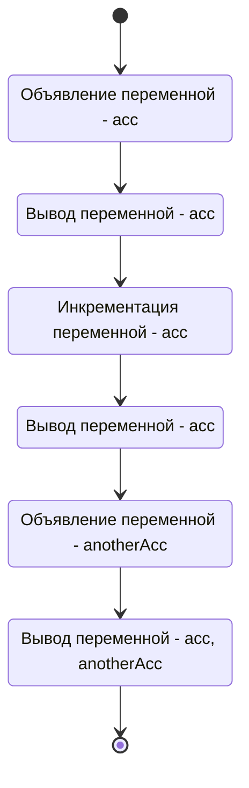
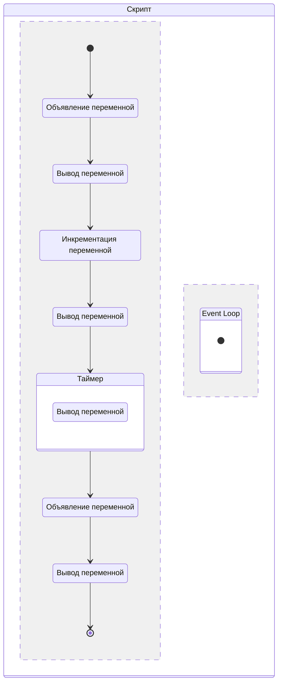
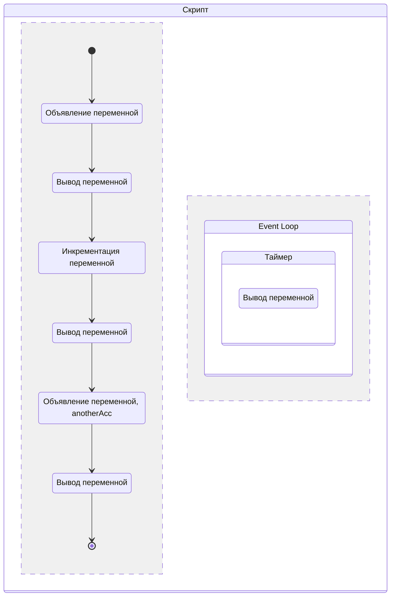
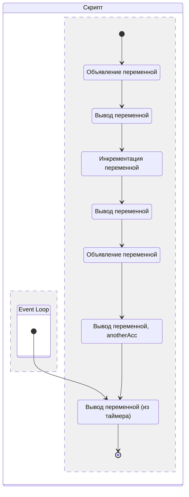
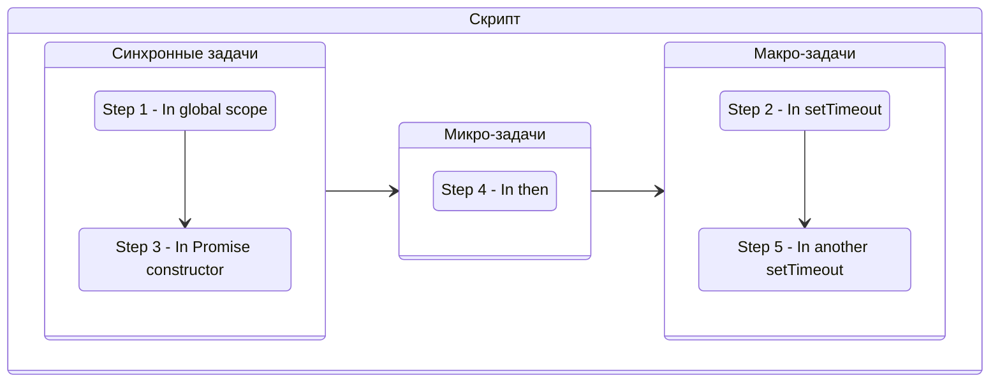
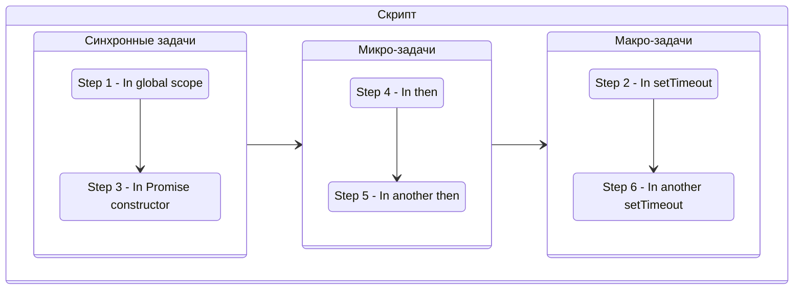
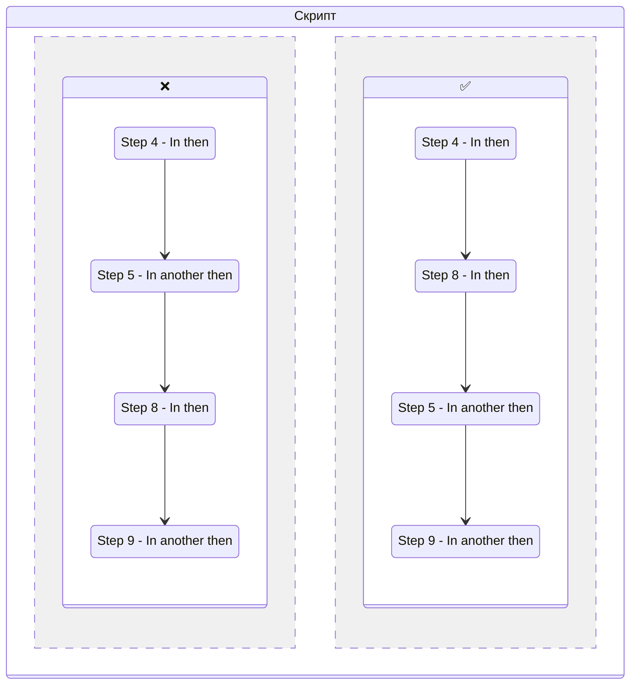
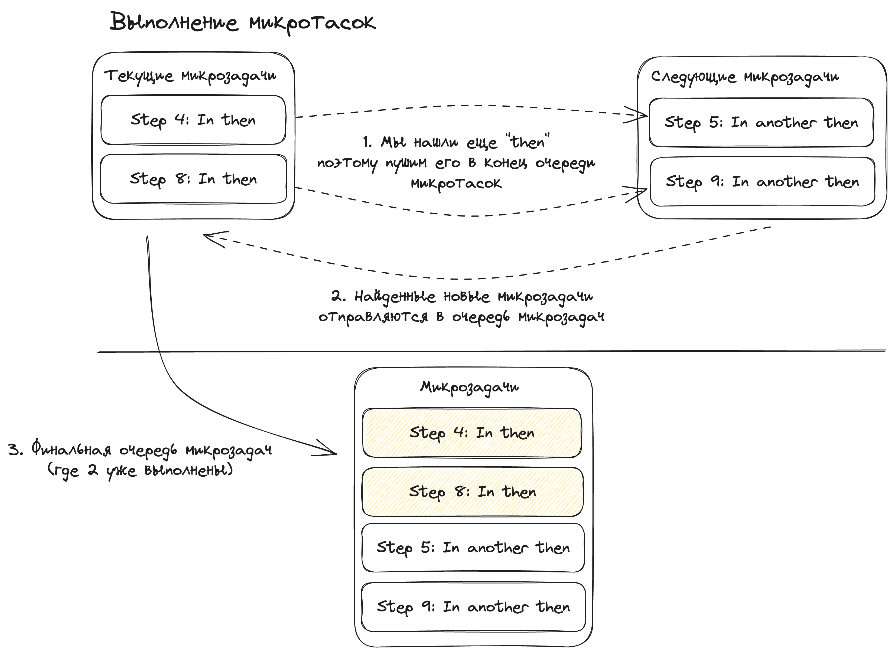
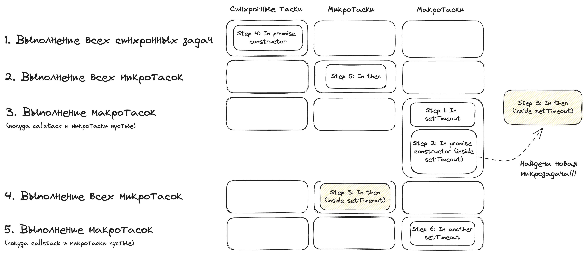

# Event Loop в деталях

В данной статье поговорим о том, почему Event Loop вообще был создан, как с ним работать и почему про него спрашивают на собесах.

JS был спроектирован как однопоточный язык программирования. Это значит, что он может выполнять только одну операцию одновременно. Тем не менее у JavaScript есть такой механизм как Event Loop, который как раз и позволяет выполнять "асинхронные" операции. Почему "асинхронные" в кавычках? Да просто потому что JavaScript тоже выполняет их синхронно, асинхронности в самом JavaScript как таковой нет. Вперед под кат, будем разбираться.

## Синхронный код

С синхронным кодом все более или менее ясно: интерпретатор проходится по каждой инструкции выполняет ее и все работает.

```js
let acc = 1;
console.log(acc); // 1

acc++;
console.log(acc); // 2

let anotherAcc = acc;
console.log(anotherAcc, acc); // 2 2
```



## Асинхронный код

С асинхронным кодом все немножко сложнее. Рассмотрим следующий пример:

```js
let acc = 1;
console.log('Call 1:', acc);

acc++;
console.log('Call 2:', acc);

setTimeout(() => {
    acc++;
    console.log('Call 3:', acc);
}, 0);

let anotherAcc = acc;
console.log('Call 4:', anotherAcc, acc);

/* Output

Call 1: 1
Call 2: 2
Call 4: 2 2
Call 3: 3

*/
```

Как мы можем увидеть `console.log`, который был в `setTimeout` почему-то выполнился позже, но почему так случилось?

Тут в силу и вступает Event Loop. Так как `setTimeout` это асинхронная операция (таймер высчитывается на стороне браузера, а не в JS).

### Проходимся по коду как интерпретатор

Давайте рассмотрим все более подробно. Мы объявляем все наши переменные и проделываем с ними какие-то операции. Все синхронные операции будут выполняться как только интерпретатор дойдет до них:



Другое дело обстоит с таймером, время которое ожидает таймаут будет считаться на стороне браузера, поэтому операция как бы "пропадет" из очереди. Таймер попал в Event Loop, где будет ждать покуда браузер не пришлет сигнал, о том что время для таймаута вышло и коллбэк внутри таймера можно выполнять.



Теперь самое неочевидное: даже если таймаут выполнился, а функция в которой мы выполняем все синхронные операции еще не выполнилась, Event Loop будет держать все что в нем содержится, покуда у нас не очистится Call Stack. **Только после того как все синхронные операции в функции выполнились** Event Loop отдаст нам наш таймер, который мы сможем выполнить:



## Лезем в дебри

Как уже было сказано выше интерпретатор в JavaScript выполняет одну операцию за раз, все что является асинхронным он отправляет в Event Loop. Однако, вы наверное могли слышать о таких вещах как "макротаски" и "микротаски".

Дело в том, что Event Loop - единственный механизм в JavaScript, который позволяет реализовать асинхронность (хотя по сути все операции выполняются синхронно, просто очень быстро, об этом далее). Event Loop является стеком, где хранятся все задачи, которые не вошли в синхронный поток выполнения. После завершения синхронного потока - задачи начинают выполняться из Event Loop'а. Однако у Event Loop'а тоже есть свои правила. Он делит все задачи на подтипы:

-   Микрозадачи
-   Макрозадачи
-   Задачи отрисовки

Макрозадачами являются все асинхронные операции, такие как [`XmlHTTPRequest`](https://developer.mozilla.org/docs/Web/API/XMLHttpRequest), [`setTimeout`](https://developer.mozilla.org/docs/Web/API/setTimeout) и так далее.

В микрозадачи попадают в основном только две категории: [`then`](https://developer.mozilla.org/docs/Web/JavaScript/Reference/Global_Objects/Promise/then) у промисов, а также [Intersection Observer](https://developer.mozilla.org/docs/Web/API/Intersection_Observer_API).

В задачи отрисовки попадают задачи связанные с отрисовкой и обновлением контента страницы.

Если бы мы делали свой Event Loop, то он бы выглядел следующим образом:

```ts
// Задача
interface Task {
    execute: () => {};
}

// Разные типы макрозадач
interface MacroTasks {
    parser: Task[];
    resources: Task[];
    domManipulation: Task[];
    events: Task[];
    callbacks: Task[];
}

// Типизация для самого Event Loop'а
interface EventLoop {
    macrotasks: MacroTasks;
    microtasks: Task[];
    nextMacrotask: () => Task | null;
    needRender: () => boolean;
    render: () => void;
}

// Переменная, которая меняется в зависимости от того
// есть ли синхронные операции в callstack
let isCallStackEmpty = false;

const eventLoop: EventLoop = {
    macrotasks: {
        parser: [], // Парсеры HTML, CSS, A11y Tree
        resources: [], // Подгрузка ресурсов
        domManipulation: [], // Манипуляции с DOM
        events: [], // Ивенты UI
        callbacks: [], // Коллбэки из setTimeout и так далее
    },

    microtasks: [],

    // Отдает нам следующую задачу из списка макрозадач
    nextMacrotask() {
        for (const macrotaskSection in this.macrotasks) {
            const queue = this.macrotasks[
                macrotaskSection as keyof typeof this.macrotasks
            ];

            if (queue.length) {
                return queue.shift() ?? null;
            }
        }
        return null;
    },

    needRender: () => false,
    render() {},
};

// Event loop начал свою работу
while (true) {
    if (!isCallStackEmpty) {
        continue;
    }

    for (const task of eventLoop.microtasks) {
        task.execute();
    }
    eventLoop.microtasks = [];

    const task = eventLoop.nextMacrotask();
    if (task) {
        task.execute();
    }

    if (eventLoop.needRender()) {
        eventLoop.render();
    }
}
```

Самое интересное в данном коде находится внизу, внутри цикла `while`:

```ts
// Event loop начал свою работу
while (true) {
    if (!isCallStackEmpty) {
        continue;
    }

    for (const task of eventLoop.microtasks) {
        task.execute();
    }
    eventLoop.microtasks = [];

    const task = eventLoop.nextMacrotask();
    if (task) {
        task.execute();
    }

    if (eventLoop.needRender()) {
        eventLoop.render();
    }
}
```

Мы можем наглядно рассмотреть как Event Loop делает решения о том какую задачу брать и выполнять первой.

1.  Сначала Event Loop проверяет выполнились ли все синхронные задачи
2.  Потом выполняются все задачи из микротасков
3.  После выполнения всех микротасков - очередь очищается
4.  Затем мы берем одну макрозадачу из списка и выполняем ее
5.  После выполнения мы смотрим нужно ли нам сделать перерисовку страницы
6.  Если перерисовать страницу нужно - делаем это
7.  Все снова начинается с первого пункта

## Эксперименты ✨

Весь этот флоу достаточно легко проверить. Давайте возьмем несколько микро и макро операций и попробуем запустить их:

```js
console.log('Step 1: In global scope');

setTimeout(() => console.log('Step 2: In setTimeout'));

new Promise((resolve) => {
    console.log('Step 3: In promise constructor');
}).then(() => console.log('Step 4: In then'));

setTimeout(() =>
    console.log('Step 5: In another setTimeout')
);

// Step 1: In global scope
// Step 3: In promise constructor
// Step 4: In then
// Step 2: In setTimeout
// Step 5: In another setTimeout
```

!!!tip "Внимание"

    На всякий случай напомню, что коллбэк внутри конструктора промиса является **синхронным**.

Как мы можем увидеть тут все выводится согласно коду, который мы рассматривали выше.

-   Сначала выполнились все синхронные операции: `Step 1`, `Step 3`;
-   Потом выполнились все микротаски: `Step 4`;
-   Затем выполнились все макротаски: `Step 2`, `Step 5`;

Следует заметить что задачи из каждой очереди реализованы по принципу FIFO (First In, First Out) (Первый вошел, первый вышел), именно поэтому в списке макрозадач вывелось `Step 2`, а затем `Step 5`.



### Два then

Теперь давайте добавим еще один `then` к нашему промису и посмотрим что случится:

```js
console.log('Step 1: In global scope');

setTimeout(() => console.log('Step 2: In setTimeout'));

new Promise((resolve) => {
    console.log('Step 3: In promise constructor');
})
    .then(() => console.log('Step 4: In then'))
    .then(() => console.log('Step 5: In another then'));

setTimeout(() =>
    console.log('Step 6: In another setTimeout')
);

// Step 1: In global scope
// Step 3: In promise constructor
// Step 4: In then
// Step 5: In another then
// Step 2: In setTimeout
// Step 6: In another setTimeout
```

Как мы можем увидеть, особо ничего не поменялось. Просто добавилась еще одна микрозадача, в целом список выводимых строк никак не поменялся, просто после `Step 4` добавился `Step 5`.



### Два `Promise` с двумя `then`

Теперь давайте попробуем провернуть то же, но уже с двумя промисами:

```js
console.log('Step 1: In global scope');

setTimeout(() => console.log('Step 2: In setTimeout'));

new Promise((resolve) => {
    console.log('Step 3: In promise constructor');
    resolve();
})
    .then(() => console.log('Step 4: In then'))
    .then(() => console.log('Step 5: In another then'));

setTimeout(() =>
    console.log('Step 6: In another setTimeout')
);

new Promise((resolve) => {
    console.log('Step 7: In promise constructor');
    resolve();
})
    .then(() => console.log('Step 8: In then'))
    .then(() => console.log('Step 9: In another then'));

// Step 1: In global scope
// Step 3: In promise constructor
// Step 7: In promise constructor
// Step 4: In then
// Step 8: In then
// Step 5: In another then
// Step 9: In another then
// Step 2: In setTimeout
// Step 6: In another setTimeout
```

Тут уже что-то по интереснее, давайте разбираться. Все синхронные задачи выполнились первыми. Затем подтянулись микротаски, но не в обычном порядке: вместо того чтобы выполнить `console.log` в последовательности `Step 4`, `Step 5`, `Step 8`, `Step 9`, он выполнился в последовательности `Step 4`, `Step 8`, `Step 5`, `Step 9`. Сейчас разберемся почему так случилось.



Дело в том, что интерпретатор JavaScript выполняет код шаг за шагом. Он увидел что у нас есть `then` и поместил их в очередь микрозадач, когда пришла микрозадачи отработали - интерпретатор увидел еще один `then` и опять поместил его в очередь микрозадач. Таким образом все `then`, которые были после первых `then` выполнялись в ряд после того как первичные `then` отработали.



### Микрозадача, внутри которой другая микрозадача

Давайте создадим промис, внутри которого будет объявляться макрозадача. Сделаем это опять же с помощью промисов:

```js
setTimeout(() => console.log('Step 1: In setTimeout'));

new Promise((resolve) => {
    console.log('Step 2: In promise constructor');
    resolve();
}).then(() => {
    console.log('Step 3: In then');
    setTimeout(() =>
        console.log(
            'Step 4: In setTimeout (inside of "then")'
        )
    );
});

setTimeout(() =>
    console.log('Step 5: In another setTimeout')
);

// Step 2: In promise constructor
// Step 3: In then
// Step 1: In setTimeout
// Step 5: In another setTimeout
// Step 4: In setTimeout (inside of "then")
```

Тут все достаточно тривиально. Во время выполнения одной из микрозадач была найдена макрозадача. Эта макрозадача была помещена в конец очереди макрозадач. Поэтому `Step 4` вывелся в конце (потому что данная микрозадача была добавлена позже всех).

# Макрозадача, внутри которой микрозадача

```js
setTimeout(() => console.log('Step 1: In setTimeout'));
setTimeout(() => {
    new Promise((resolve) => {
        console.log(
            'Step 2: In promise constructor (inside setTimeout)'
        );
        resolve();
    }).then(() =>
        console.log('Step 3: In then (inside setTimeout)')
    );
});

new Promise((resolve) => {
    console.log('Step 4: In promise constructor');
    resolve();
}).then(() => {
    console.log('Step 5: In then');
});

setTimeout(() =>
    console.log('Step 6: In another setTimeout')
);

// Step 4: In promise constructor
// Step 5: In then
// Step 1: In setTimeout
// Step 2: In promise constructor (inside setTimeout)
// Step 3: In then (inside setTimeout)
// Step 6: In another setTimeout
```

Давайте вспомним что макрозадачи выполняются по одной. Перед тем как выполнять каждую следующую задачу Event Loop проверяет нет ли у нас активных задач из Call Stack, а также нет ли микрозадач.

Как только новая задача находится и Call Stack пустой - она сразу же выполняется. Вот почему `Step 3` выполнился сразу же после `Step 2`.


