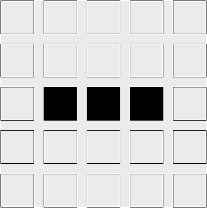

# Правила "Игры жизни" Конвея

Примечание: если вы уже знакомы с "Игрой жизни Конвея" и ее правилами, переходите к следующему разделу!

[Википедия дает отличное описание правил "Игры жизни Конвея":][wikipedia]

> Вселенная игры Game of Life - это бесконечная двумерная ортогональная сетка квадратных клеток, каждая из которых находится в одном из двух возможных состояний: живая или мертвая, "заселенная" или "незаселенная". Каждая клетка взаимодействует со своими восемью соседями - клетками, расположенными рядом по горизонтали, вертикали или диагонали. На каждом шаге во времени происходят следующие переходы:
>
> 1. Любая живая клетка, имеющая менее двух живых соседей, погибает, как если бы это было вызвано перенаселением.
>
> 2. Любая живая клетка с двумя или тремя живыми соседями переходит в следующее поколение.
>
> 3. Любая живая клетка с более чем тремя живыми соседями погибает, как при перенаселении.
>
> 4. Любая мертвая клетка с ровно тремя живыми соседями становится живой клеткой, как при размножении.
>
> Начальный шаблон представляет собой семя системы. Первое поколение создается путем одновременного применения вышеуказанных правил к каждой клетке в семени - рождение и смерть происходят одновременно, а дискретный момент, когда это происходит, иногда называют тиком (другими словами, каждое поколение является чистой функцией предыдущего). Эти правила продолжают применяться многократно для создания последующих поколений.

[wikipedia]: https://ru.wikipedia.org/wiki/Игра_«Жизнь»

Рассмотрим следующую начальную вселенную:

Мы можем вычислить следующее поколение, рассмотрев каждую клетку. Левая верхняя клетка мертва. Правило (4) - единственное правило перехода, которое применяется к мертвым клеткам. Однако, поскольку у левой верхней клетки нет ровно трех живых соседей, правило перехода не действует, и она остается мертвой в следующем поколении. То же самое происходит и со всеми остальными клетками в первом ряду.

Ситуация становится интересной, когда мы рассматриваем верхнюю живую клетку во втором ряду, третьем столбце. Для живых клеток потенциально применимо любое из первых трех правил. В случае с этой клеткой у нее есть только один живой сосед, и поэтому действует правило (1): эта клетка умрет в следующем поколении. Та же участь ожидает нижнюю живую клетку.

У средней живой клетки есть два живых соседа: верхняя и нижняя живые клетки. Это означает, что к ней применимо правило (2), и она останется живой в следующем поколении.

Последний интересный случай - это мертвые клетки слева и справа от средней живой клетки. Все три живые клетки являются соседями обеих этих клеток, что означает, что правило (4) применимо, и эти клетки станут живыми в следующем поколении.

Сложите все это вместе, и мы получим следующую вселенную после следующего тика:

Из этих простых, детерминированных правил вытекает странное и захватывающее поведение:

| Gosper's glider gun                                                                                | Pulsar                                                                                 | Space ship                                                                                                   |
| -------------------------------------------------------------------------------------------------- | -------------------------------------------------------------------------------------- | ------------------------------------------------------------------------------------------------------------ |
|  |  |  |

<iframe width="560" height="315" src="https://www.youtube.com/embed/C2vgICfQawE?si=n1byBqfGDFaKcJcB" title="YouTube video player" frameborder="0" allow="accelerometer; autoplay; clipboard-write; encrypted-media; gyroscope; picture-in-picture; web-share" referrerpolicy="strict-origin-when-cross-origin" allowfullscreen></iframe>

## Упражнения

Вычислите вручную следующий тик нашего примера вселенной. Заметили что-то знакомое?

!!!note "Answer"

    Это должно быть начальное состояние примера вселенной:

    

    Этот паттерн является _периодическим_: он возвращается в исходное состояние через каждые два тика.

Можете ли вы найти начальную вселенную, которая была бы стабильной? То есть такую вселенную, в которой каждое поколение всегда одно и то же.

!!!note "Answer"

    Существует бесконечное число стабильных вселенных! Тривиально стабильная вселенная - это пустая вселенная. Квадрат два на два из живых клеток - тоже стабильная вселенная.
