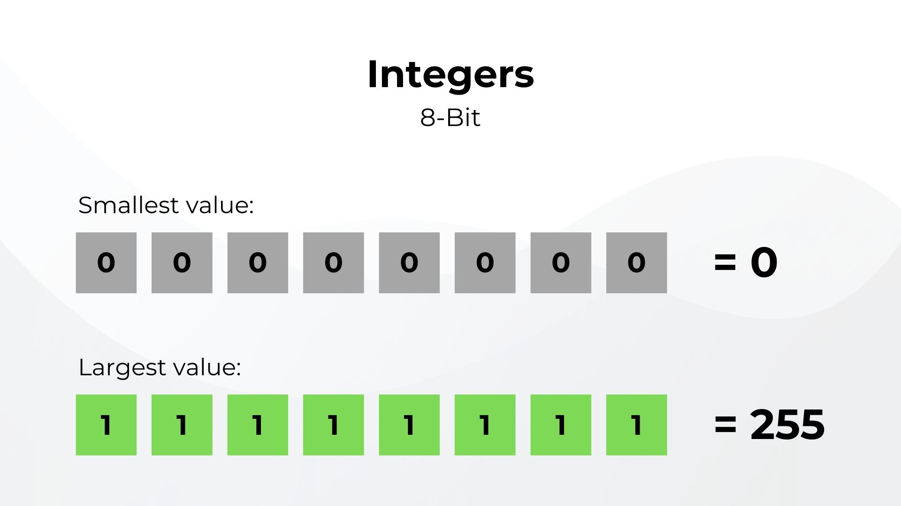
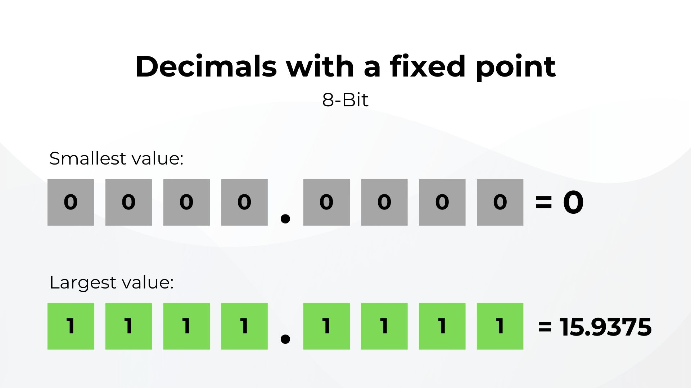
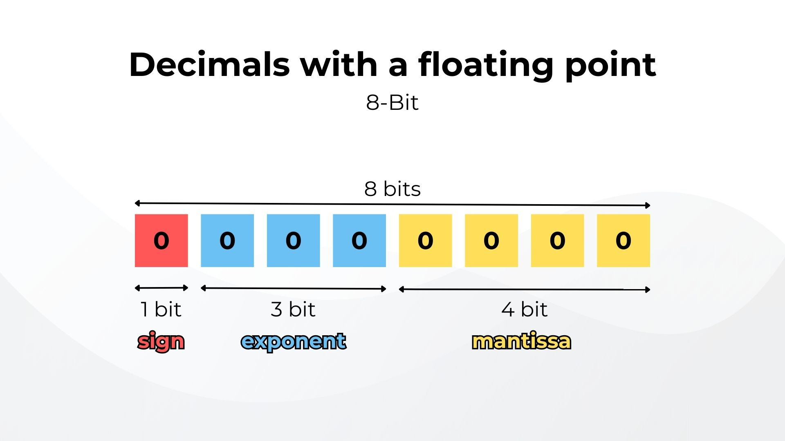

# Осмысление "бессмысленных" свойств JavaScript

<big>JavaScript может быть самым популярным в мире языком клиентской части, но он далек от совершенства и не лишен причуд. Хуан Диего Родригес рассматривает несколько "абсурдных" эксцентричностей JavaScript и объясняет, как они попали в язык, а также как избежать их в собственном коде.</big>

Почему JavaScript имеет так много эксцентриситетов! Например, почему `0.2 + 0.1` равно `0.30000000000000004`? Или почему `"" == false` оценивается как `true`?

В JavaScript есть множество умопомрачительных решений, которые кажутся бессмысленными; некоторые из них неправильно поняты, а другие являются прямыми ошибками при проектировании. Как бы то ни было, стоит знать, что это за странные вещи и почему они присутствуют в языке. Я расскажу о самых странных, на мой взгляд, вещах в JavaScript и объясню их смысл.

## `0.1 + 0.2` и формат с плавающей точкой

Многие из нас издевались над JavaScript, написав в консоли `0.1 + 0.2` и наблюдая, как он с треском проваливается, не получая `0.3`, а скорее забавно выглядящее значение `0.30000000000000004`.

Многие разработчики могут не знать, что в этом странном результате JavaScript не виноват! JavaScript просто придерживается [стандарта IEEE для арифметики с плавающей точкой](https://ieeexplore.ieee.org/document/8766229), который используют почти все остальные компьютеры и языки программирования для представления чисел.

Но что именно представляет собой арифметика с плавающей точкой?

Компьютерам приходится представлять числа всех размеров, от расстояния между планетами и даже между атомами. На бумаге легко написать огромное число или мизерную величину, не задумываясь о том, какого размера оно будет. Компьютеры не могут похвастаться такой роскошью, поскольку им приходится сохранять все виды чисел в двоичном виде и занимать небольшое пространство в памяти.

Возьмем, к примеру, 8-битное целое число. В двоичном виде оно может хранить целые числа от `0` до `255`.



Ключевое слово здесь - целые числа. Между ними не может быть десятичных дробей. Чтобы исправить это, мы можем добавить мнимую десятичную точку где-то в 8-битной системе с тем, чтобы биты перед точкой использовались для представления целой части, а остальные - для десятичной. Поскольку точка всегда находится в одном и том же мнимом месте, это называется **десятичной дробью с фиксированной точкой**. Но за это приходится платить, так как диапазон сокращается от `0` до `255` до значений от `0` до `15.9375`.



Повышение точности означает потерю дальности, и наоборот. Также необходимо учитывать, что компьютеры должны удовлетворять большое количество пользователей с разными требованиями. Инженер, строящий мост, не слишком беспокоится, если измерения отклоняются на небольшую величину, скажем, на сотые доли сантиметра. Но, с другой стороны, та же сотая доля сантиметра может обойтись гораздо дороже для того, кто создает микрочип. Необходима разная точность, и последствия ошибки могут быть разными.

Еще одно соображение - размер памяти, в которой хранятся числа, поскольку хранить длинные числа в мегабайтах не представляется возможным.

Формат с _плавающей точкой_ родился из этой потребности представлять большие и малые величины с точностью и эффективностью. Он состоит из трех частей:

1.  Один бит, обозначающий, является ли число положительным или отрицательным (`0` - положительным, `1` - отрицательным).
2.  [Знак](https://mathworld.wolfram.com/Significand.html) или [мантисса](https://mathworld.wolfram.com/Mantissa.html), содержащая цифры числа.
3.  **Экспонента** определяет, где находится десятичная (или двоичная) точка относительно начала мантиссы, подобно тому, как работает научная система счисления. Следовательно, точка может перемещаться в любую позицию, отсюда и _плавающая_ точка.



8-битный формат с плавающей точкой может представлять числа от `0.0078` до `480` (и их отрицательные значения), но заметьте, что представление с плавающей точкой не может представлять все числа в этом диапазоне. Это невозможно, поскольку 8 бит могут представлять только 256 различных значений. Неизбежно, что многие числа не могут быть точно представлены. В этом диапазоне есть пробелы. Компьютеры, конечно, работают с большим количеством бит, чтобы увеличить точность и диапазон, обычно с 32 и 64 битами, но невозможно точно представить все числа, и это небольшая цена, если учесть диапазон, который мы получаем, и память, которую мы экономим.

Точная динамика гораздо сложнее, но пока нам достаточно понимать, что хотя этот формат позволяет выражать числа в большом диапазоне, он теряет точность (увеличиваются промежутки между представляемыми значениями), когда они становятся слишком большими. Например, числа в JavaScript представлены в формате двойной точности с плавающей точкой, то есть каждое число представлено в памяти в 64 битах, оставляя 53 бита для представления мантиссы. Это означает, что JavaScript может безопасно представлять целые числа только в диапазоне от -(2^53^ - 1) до 2^53^ - 1 без потери точности. После этого арифметика перестает иметь смысл. Именно поэтому у нас есть статическое свойство данных `Number.MAX_SAFE_INTEGER` для представления максимально безопасного целого числа в JavaScript, которое составляет (2^53^ - 1) или `9007199254740991`.

Но `0.3` явно ниже порога `MAX_SAFE_INTEGER`, так почему же мы не можем получить его при сложении `0.1` и `0.2`? Формат с плавающей точкой испытывает трудности с некоторыми дробными числами. Это не проблема формата с плавающей запятой, но она точно есть в любой системе счисления.

Чтобы убедиться в этом, давайте представим одну треть (1⁄3) в системе счисления base-10.

```
0.3
```

---

```
0.33
```

---

```
0.3333333 [...]
```

Сколько бы цифр мы ни пытались записать, результат никогда не будет равен одной трети. Точно так же мы не можем точно представить некоторые дробные числа в формате base-2 или двоичном. Возьмем, к примеру, `0.2`. Мы можем без проблем записать его в base-10, но если попытаемся записать его в двоичном виде, то получим в конце повторяющееся бесконечно число `1001`.

```
0.001 1001 1001 1001 1001 1001 10 [...]
```

Очевидно, что мы не можем иметь бесконечно большое число, поэтому в какой-то момент мантисса должна быть усечена, что не позволяет не потерять точность в процессе. Если мы попытаемся преобразовать `0.2` из числа с плавающей точкой двойной точности обратно в base-10, то увидим, что в памяти сохранилось фактическое значение:

```
0.200000000000000011102230246251565404236316680908203125
```

Это не `0.2`! Мы не можем представить огромное количество дробных значений - не только в JavaScript, но и почти во всех компьютерах. Так почему же выполнение `0.2 + 0.2` правильно вычисляет `0.4`? В данном случае неточность настолько мала, что округляется Javascript (до 16-го знака после запятой), но иногда неточности достаточно, чтобы избежать механизма округления, как в случае с `0.2 + 0.1`. Мы можем увидеть, что происходит под капотом, если попробуем сложить фактические значения `0.1` и `0.2`.

Это фактическое значение, сохраненное при записи `0.1`:

```
0.1000000000000000055511151231257827021181583404541015625
```

Если мы вручную просуммируем фактические значения `0.1` и `0.2`, то увидим виновника:

```
0.3000000000000000444089209850062616169452667236328125
```

Это значение округляется до `0.30000000000000004`. Вы можете проверить реальные значения, сохраненные на сайте [float.exposed](https://float.exposed/0x3fb999999999999a).

Плавающая точка имеет свои известные недостатки, но ее положительные стороны перевешивают их, и она является стандартом во всем мире. В этом смысле радует, что все современные системы выдают нам один и тот же результат `0.30000000000000004` на разных архитектурах. Это может быть не тот результат, который вы ожидаете, но это результат, который вы можете предсказать.

## Принудительное определение типа

JavaScript - динамически типизированный язык, то есть нам не нужно объявлять тип переменной, и он может быть изменен позже в коде.

!!!quote ""

    Я считаю динамически типизированные языки более свободными, поскольку мы можем больше сосредоточиться на сути кода.

Проблема возникает из-за слабой типизации, так как во многих случаях язык пытается выполнить неявное преобразование между различными типами, например, из строк в числа или из _ложных_ и _истинных_ значений. Это особенно актуально при использовании операторов равенства (`==`) и знака плюс (`+`). Правила согласования типов сложны, трудно запоминаемы и в некоторых ситуациях даже неверны. Лучше избегать использования `==` и всегда отдавать предпочтение оператору строгого равенства (`===`).

Например, JavaScript преобразует строку в число, если сравнить ее с другим числом:

```js
console.log('2' == 2); // true
```

Обратное применимо к оператору со знаком плюс (`+`). Он будет пытаться превратить число в строку, когда это возможно:

```js
console.log(2 + '2'); // "22"
```

Поэтому оператор со знаком плюс (`+`) следует использовать только в том случае, если мы уверены, что значения являются числами. При конкатенации строк лучше использовать метод [`concat()`](https://developer.mozilla.org/docs/Web/JavaScript/Reference/Global_Objects/String/concat) или [шаблонные литералы](https://developer.mozilla.org/docs/Web/JavaScript/Reference/Template_literals).

Причина появления таких принуждений в языке на самом деле абсурдна. Когда создателя JavaScript Брендана Эйха спросили, что бы [он сделал по-другому](https://thenewstack.io/brendan-eich-on-creating-javascript-in-10-days-and-what-hed-do-differently-today#:~:text=notorious) при разработке JavaScript, он ответил, что был бы более щепетилен в реализации, которую хотели получить ранние пользователи языка:

!!!quote "Brendan Eich"

    "Я бы избежал некоторых компромиссов, на которые я пошел, когда у меня появились первые последователи, и они сказали: "Вы можете это изменить?".

Самый яркий пример - причина, по которой у нас есть два оператора равенства, `==` и `===`. Когда один из первых пользователей JavaScript объяснил, что ему нужно сравнить число со строкой без необходимости менять код для преобразования, Брендан добавил оператор свободного равенства, чтобы удовлетворить эти потребности.

Существует множество других правил, управляющих оператором свободного равенства (и другими операторами, проверяющими условие), которые заставляют разработчиков JavaScript ломать голову. Они сложны, утомительны и бессмысленны, поэтому нам следует любой ценой избегать оператора свободного равенства (`==`) и заменить его строгим омонимом (`===`).

Зачем вообще нужны два оператора равенства? Много факторов, но мы можем указать пальцем на Гая Л. Стила, соавтора языка программирования Scheme. Он заверил Эйха, что мы всегда сможем добавить еще один оператор равенства, поскольку в языке Lisp есть диалекты с пятью различными операторами равенства! Такой менталитет опасен, и в наши дни все возможности должны подвергаться тщательному анализу, потому что мы всегда можем добавить новые возможности, но как только они появляются в языке, их уже нельзя удалить.

## Автоматическая вставка точки с запятой

При написании кода на JavaScript точка с запятой (`;`) необходима в конце некоторых операторов, в том числе:

-   `var`, `let`, `const`;
-   выражения операторов;
-   `do...while`;
-   `continue`, `break`, `return`, `throw`;
-   `debugger`;
-   Объявление полей класса (public или private);
-   `import`, `export`.

При этом нам не обязательно каждый раз вставлять точку с запятой, поскольку JavaScript может **автоматически вставлять точки с запятой** в процессе, неудивительно известном как автоматическая вставка точек с запятой (ASI). Он был задуман для того, чтобы облегчить кодирование для новичков, которые не знают, где нужна точка с запятой, но это ненадежная функция, и нам следует придерживаться явного ввода места, где ставится точка с запятой. Линтеры и форматтеры добавляют точку с запятой там, где это сделал бы ASI, но они тоже не совсем надежны.

ASI может заставить работать некоторый код, но в большинстве случаев это не так. Возьмем следующий код:

```
const a = 1
(1).toString()

const b = 1
[1, 2, 3].forEach(console.log)
```

Вы, вероятно, видите, куда делись точки с запятой, и если бы мы отформатировали это правильно, то получилось бы так:

```js
const a = 1;

(1).toString();

const b = 1;

[(1, 2, 3)].forEach(console.log);
```

Но если мы передадим предыдущий код непосредственно в JavaScript, то возникнут всевозможные исключения, поскольку это будет то же самое, что написать вот это:

```js
const a = 1(1).toString();

const b = (1)[(1, 2, 3)].forEach(console.log);
```

В заключение хочу сказать, что знайте свои точки с запятой.

## Почему так много "нижних" значений?

Термин "нижний" часто используется для обозначения значения, которое не существует или не определено. Но почему в JavaScript есть два вида нижних значений?

Все в JavaScript можно считать объектом, кроме двух нижних значений `null` и `undefined` (несмотря на то, что `typeof null` возвращает `object`). Попытка получить от них значение свойства вызывает исключение.

Обратите внимание, что, строго говоря, **все примитивные значения не являются объектами**. Но только `null` и `undefined` не подвергаются [боксированию](https://stackoverflow.com/questions/34067261/is-boxing-coercion-in-javascript).

Можно даже считать `NaN` третьим нижним значением, которое представляет собой отсутствие числа. Обилие нижних значений следует рассматривать как ошибку проектирования. Нет прямой причины, объясняющей существование двух нижних значений, но мы видим разницу в том, как JavaScript использует их.

`undefined` - это нижнее значение, которое JavaScript использует по умолчанию, поэтому считается хорошей практикой использовать его исключительно в коде. Когда мы определяем переменную без начального значения, попытка извлечь ее приводит к присвоению `undefined` значения. То же самое происходит, когда мы пытаемся получить доступ к несуществующему свойству объекта. Чтобы максимально соответствовать поведению JavaScript, используйте `undefined` для обозначения существующего свойства или переменной, не имеющей значения.

С другой стороны, `null` используется для обозначения отсутствия объекта (следовательно, его `typeof` возвращает `object`, хотя он им не является). Однако это считается ошибкой, потому что `undefined` могло бы выполнять свои функции так же эффективно. В JavaScript он используется для обозначения конца рекурсивной структуры данных. Точнее, он используется в цепочке прототипов для обозначения ее конца. В большинстве случаев вы можете использовать `undefined` вместо `null`, но есть случаи, когда можно использовать только `null`, как в случае с [`Object.create`](https://developer.mozilla.org/docs/Web/JavaScript/Reference/Global_Objects/Object/create), когда мы можем создать объект без прототипа только передав `null`; использование `undefined` возвращает ошибку типа `TypeError`.

И `null`, и `undefined` страдают от проблемы пути. При попытке получить доступ к свойству из нижнего значения - как если бы они были объектами - возникают исключения.

```js
let user;

let userName = user.name; // Uncaught TypeError

let userNick = user.name.nick; // Uncaught TypeError
```

Обойти это невозможно, если только не проверять каждое значение свойства перед попыткой доступа к следующему, используя логическое AND (`&&`) или необязательную цепочку (`?`).

```js
let user;

let userName = user?.name;

let userNick = user && user.name && user.name.nick;

console.log(userName); // undefined

console.log(userNick); // undefined
```

Я уже говорил, что `NaN` можно считать нижним значением, но у него есть свое запутанное место в JavaScript, поскольку он представляет числа, которые на самом деле не являются числами, обычно из-за неудачного преобразования строки в число (что является еще одной причиной избегать его). `NaN` имеет свои собственные махинации, потому что оно не равно самому себе! Чтобы проверить, является ли значение `NaN` или нет, используйте `Number.isNaN()`.

Мы можем проверить все три нижних значения с помощью следующего теста:

```js
function stringifyBottom(bottomValue) {
    if (bottomValue === undefined) {
        return 'undefined';
    }

    if (bottomValue === null) {
        return 'null';
    }

    if (Number.isNaN(bottomValue)) {
        return 'NaN';
    }
}
```

## Инкремент (`++`) и декремент (`--`)

Как разработчики, мы склонны тратить больше времени на чтение кода, чем на его написание. Читаем ли мы документацию, просматриваем чужую работу или проверяем свою, **читабельность кода увеличит нашу производительность по сравнению с краткостью**. Другими словами, читабельность экономит время в долгосрочной перспективе.

Вот почему я предпочитаю использовать `+ 1` или `- 1`, а не операторы инкремента (`++`) и декремента (`--`).

Нелогично иметь отдельный синтаксис только для увеличения значения на единицу, а также иметь форму до увеличения и форму после увеличения в зависимости от места расположения оператора. Их очень легко перепутать, и это может быть трудно отладить. Им не должно быть места в вашем коде или даже в языке в целом, если мы рассмотрим, откуда берутся операторы инкремента.

Как мы видели [в предыдущей статье](https://www.smashingmagazine.com/2023/12/marketing-changed-oop-javascript/), синтаксис JavaScript в значительной степени вдохновлен языком C, в котором используются переменные-указатели. Переменные-указатели были разработаны для хранения в памяти адресов других переменных, что позволяет динамически распределять память и манипулировать ею. Операторы `++` и `--` изначально были созданы для того, чтобы продвигаться вперед или возвращаться назад по ячейкам памяти.

В настоящее время доказано, что арифметика указателей вредна и может привести к случайному доступу к участкам памяти за пределами предполагаемых границ массивов или буферов, что приводит к ошибкам памяти - печально известному источнику багов и уязвимостей. Тем не менее, синтаксис попал в JavaScript и остается там по сей день.

Хотя использование `++` и `--` остается стандартом среди разработчиков, можно привести аргумент в пользу удобства чтения. Выбор `+ 1` или `- 1` вместо `++` и `--` не только соответствует принципам ясности и четкости, но и избавляет от необходимости иметь дело с формой до и после увеличения.

В целом, это не жизненно важная ситуация, но хороший способ сделать ваш код более читабельным.

## Заключение

Кажущиеся бессмысленными особенности JavaScript часто возникают в результате исторических решений, компромиссов и попыток удовлетворить все потребности. К сожалению, невозможно сделать всех счастливыми, и JavaScript не является исключением.

!!!quote ""

    JavaScript не обязан подстраиваться под всех разработчиков, но каждый разработчик обязан понимать язык и использовать его сильные стороны, не забывая при этом о его причудах.

Я надеюсь, что вам стоит продолжать узнавать все больше и больше о JavaScript и его истории, чтобы разобраться в его непонятных особенностях и сомнительных решениях. Возьмем, к примеру, его удивительную прототипическую природу. Это было скрыто во время разработки или таких ошибок, как ключевое слово `this` и его многоцелевое поведение.

В любом случае, я рекомендую каждому разработчику изучить язык и узнать о нем больше. И если вам интересно, я немного углублюсь в сомнительные области дизайна JavaScript в [другой статье](https://www.smashingmagazine.com/2023/12/marketing-changed-oop-javascript/), опубликованной здесь, на Smashing Magazine!
