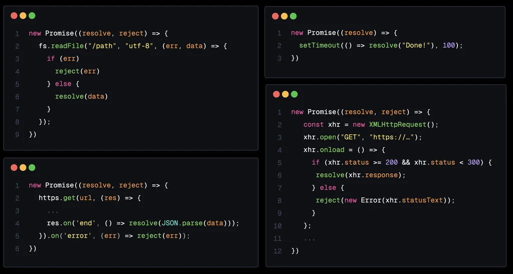

# Визуализация JavaScript: выполнение промисов

Промисы в JavaScript поначалу могут показаться немного пугающими, но понимание того, что происходит под капотом, может сделать их гораздо более доступными. 

В этой статье мы погрузимся во внутреннюю работу промисов и узнаем, как они позволяют выполнять неблокирующие асинхронные задачи в JavaScript.

<iframe width="560" height="315" src="https://www.youtube.com/embed/Xs1EMmBLpn4?si=2EIjhb2YMuGXi-rx" title="YouTube video player" frameborder="0" allow="accelerometer; autoplay; clipboard-write; encrypted-media; gyroscope; picture-in-picture; web-share" referrerpolicy="strict-origin-when-cross-origin" allowfullscreen></iframe>

Один из способов создания промиса - использование конструктора `new Promise`, который получает *функцию-исполнителя* с аргументами `resolve` и `reject`.

```js
new Promise((resolve, reject) => {
   // TODO(Lydia): Некоторые асинхронные вещи здесь
});
```

Когда вызывается конструктор промисов, происходит несколько вещей:

-   Создается [объект промиса](https://tc39.es/ecma262/#sec-properties-of-promise-instances).

	Этот объект промиса содержит несколько внутренних слотов, включая `[[PromiseState]]`, `[[PromiseResult]]`, `[[PromiseIsHandled]]`, `[[PromiseFulfillReactions]]` и `[[PromiseRejectReactions]]`.

-   Создается [запись возможности промиса](https://tc39.es/ecma262/#sec-promisecapability-records)

	Она "инкапсулирует" промис и добавляет некоторые дополнительные функции для разрешения или отклонения промиса.  Это функции, которые управляют конечным состоянием `[[PromiseState]]` и `[[PromiseResult]]` промиса и запускают асинхронные задачи.

<video src="./1.mp4" controls></video>

Мы можем *разрешить* этот промис, вызвав `resolve`, который доступен нам через функцию `executor`. Когда мы вызываем `resolve`:

-   `[[PromiseState]]` устанавливается в значение `"fulfilled"`
-   `[[PromiseResult]]` устанавливается в значение, которое мы передали `resolve` и которое в данном случае равно `"Done!"`.

<video src="./2.mp4" controls></video>

Процесс аналогичен вызову `reject`, теперь `[[PromiseState]]` устанавливается в `"rejected"`, а `[[PromiseResult]]` устанавливается в значение, которое мы передали `reject`, то есть `"Fail!"`.

<video src="./3.mp4" controls></video>

Конечно, здорово... но что такого особенного в использовании функций для изменения внутренних свойств объекта?

Ответ кроется в поведении, связанном с двумя внутренними слотами, которые мы до сих пор пропускали: `[[PromiseFulfillReactions]]` и `[[PromiseRejectReactions]]`.

---

Поле `[[PromiseFulfillReactions]]` содержит **реакции промиса**. Это объект, созданный путем присоединения обработчика `then` к промису.  

Эта **реакция промиса** содержит, помимо прочих полей, свойство `[[Handler]]`, содержащее функцию обратного вызова, которую мы передали в `then`. Когда промис разрешается, этот обработчик добавляется в *очередь микрозадач* и получает доступ к значению, с которым промис разрешился.

<video src="./4.mp4" controls></video>

Когда промис разрешается, этот обработчик получает в качестве аргумента значение `[[PromiseResult]]`, после чего оно пересылается в *очередь микрозадач*.

Именно здесь вступает в силу асинхронная часть промисов!

<video src="./5.mp4" controls></video>

!!!note "Очередь микрозадач"

	**Очередь микрозадач** - это специализированная очередь в цикле событий.  Когда *стек вызовов* пуст, цикл событий сначала обрабатывает задачи, ожидающие в *очереди микрозадач*, прежде чем обрабатывать задачи из обычной *очереди задач* (также называемой "очередью обратных вызовов" или "очередью макрозадач"). 

	Я нахожусь в процессе обновления своей [статьи в блоге от 2019 года](https://dev.to/lydiahallie/javascript-visualized-event-loop-3dif), но здесь вы можете прочитать немного больше о цикле событий. Я также рассказываю о нем в своем [курсе FrontendMasters](https://frontendmasters.com/courses/javascript-quiz/).

	<video src="./6.mp4" controls></video>

Аналогичным образом мы можем создать запись *Promise Reaction* для обработки отказа от выполнения промиса с помощью цепочки `catch`. Этот обратный вызов будет добавлен в очередь микрозадач, когда промис будет отклонен.

<video src="./4.mp4" controls></video>

---

До сих пор мы вызывали `resolve` или `reject` только непосредственно в функции-исполнителе. Хотя это и *возможно*, но не позволяет использовать всю мощь (и основное назначение) промисов!

В большинстве случаев мы хотим вызвать `resolve` или `reject` в какой-то более поздний момент времени, обычно после завершения асинхронной задачи.

Асинхронные задачи выполняются вне основного потока, например чтение файла (например, `fs.readFile`), выполнение сетевых запросов (например, `https.get` или `XMLHttpRequest`) или что-то простое, как таймеры (`setTimeout`).



Когда эти задачи завершатся в какое-то неизвестное время в будущем, мы можем использовать обратный вызов, который обычно предоставляют такие async-операции, чтобы либо разрешить (`resolve`) их с помощью данных, которые мы получили от async-задачи, либо отклонить (`reject`), если произошла ошибка.

---

Чтобы наглядно представить это, давайте пройдемся по шагам. Чтобы сделать демонстрацию простой, но реалистичной, мы используем `setTimeout`, чтобы добавить асинхронное поведение.

```js
new Promise((resolve) => {
    setTimeout(() => resolve("Done!"), 100);
}).then(result => console.log(result))
```

Сначала в *стек вызовов* добавляется конструктор нового промиса `new Promise`, который создает *объект промиса*.

<video src="./8.mp4" controls></video>

Затем выполняется функция-исполнитель. В первой строке тела функции мы вызываем `setTimeout`, который добавляется в стек вызовов.

`setTimeout` отвечает за планирование таймера в Timers Web API с задержкой в 100 мс, после чего обратный вызов, который мы передали в `setTimeout`, будет помещен в *очередь задач*.

<video src="./8.mp4" controls></video>

!!!note ""

	Это асинхронное поведение связано с `setTimeout`, а не с промисами.  Я просто показываю это здесь, чтобы продемонстрировать распространенный способ использования промисов - разрешение промиса после некоторой задержки.

	Однако сама задержка не вызвана промисами. Промисы предназначены для работы с асинхронными операциями, но эти асинхронные операции могут происходить из разных источников, например таймеров или сетевых запросов.

После того как таймер и конструктор выведены из *стека вызовов*, движок встречается с `then`.

`then` добавляется в стек вызовов и создает запись *Promise Reaction*, обработчиком которой является код, переданный нами в качестве обратного вызова обработчику `then`.

Поскольку состояние `[[PromiseState]]` все еще `"pending"`, эта запись *Promise Reaction* добавляется в список `[[PromiseFulfillReactions]]`.

<video src="./9.mp4" controls></video>

По истечении 100 мс обратный вызов `setTimeout` будет помещен в *очередь задач*.

Сценарий уже завершил выполнение, поэтому *стек вызовов* пуст. В *очереди микрозадач* также ничего нет, а это значит, что теперь эта задача взята из *очереди задач* в *стек вызовов*.

Обратный вызов выполняется и вызывает `resolve`.

<video src="./10.mp4" controls></video>

Вызов `resolve` устанавливает `[[PromiseState]]` в `"fulfilled"`, `[[PromiseResult]]` в `"Done!"`, а код, связанный с обработчиком реакции промиса, добавляется в *очередь микрозадач*.

`resolve` и обратный вызов выгружаются из *стека вызовов*.

<video src="./11.mp4" controls></video>

Поскольку *стек вызовов* пуст, цикл событий сначала проверяет *очередь микрозадач*, где `then` ожидает обратный вызов обработчика.

Теперь обратный вызов добавляется в *стек вызовов* и регистрирует значение `result`, которое является значением `[[PromiseResult]]` - строка `"Done!"`.

<video src="./12.mp4" controls></video>

Как только обратный вызов завершит выполнение и будет удален из стека вызовов, программа будет завершена!

---

Помимо создания промиса Reaction, `then` также возвращает промис. Это означает, что мы можем соединить в цепочку несколько `then`, например:

```js
new Promise((resolve) => {
   resolve(1)
})
  .then(result => result * 2)
  .then(result => result * 2)
  .then(result => console.log(result));
```

Когда этот код выполняется, при вызове конструктора промиса создается *объект промиса*. После этого всякий раз, когда движок встречает `then`, создаются как запись реакции промиса, так и объект промиса.

В обоих случаях обратные вызовы `then` умножают полученное значение `[[PromiseResult]]` на два.  Значение `[[PromiseResult]]` в `then` устанавливается на результат этого вычисления, который, в свою очередь, используется следующим обработчиком `then`.

<video src="./13.mp4" controls></video>

В конечном итоге результат записывается в журнал. Результат `[[PromiseResult]]` последнего промиса `then` не определен, поскольку мы явно не вернули значение, а значит, он неявно вернул `undefined`.

Конечно, использование чисел - не самый *реалистичный* сценарий. Вместо этого вы можете захотеть изменять результат выполнения промиса шаг за шагом, как при постепенном изменении внешнего вида изображения.

Например, вы можете предпринять ряд поэтапных шагов, изменяющих внешний вид изображения с помощью таких операций, как изменение размера, применение фильтров, добавление водяных знаков и т. д.

```js
function loadImage(src) {
	return new Promise((resolve, reject) => {
		const img = new Image();
		img.onload = () => resolve(img);
		img.onerror = reject;
		img.src = src;
	})
}

loadImage(src)
	.then(image => resizeImage(image))
	.then(image => applyGrayscaleFilter(image))
	.then(image => addWatermark(image))
```

Задачи такого типа часто включают асинхронные операции, поэтому промисы являются хорошим выбором для неблокирующего управления.

---

**Заключение**

Короче говоря, промисы - это просто объекты с некоторой дополнительной функциональностью для изменения их внутреннего состояния.

Самое замечательное в промисах то, что они могут запускать асинхронные действия, если к ним подключен обработчик с помощью `then` или `catch`. Так как обработчики передаются в *очередь микрозадач*, вы можете обрабатывать конечный результат неблокирующим способом. Это упрощает обработку ошибок, создание цепочек из нескольких операций, а также делает ваш код более читаемым и удобным для сопровождения!

Промисы остаются основополагающей концепцией, которую должен знать каждый разработчик JavaScript. Другие возможности, такие как синтаксис `async`/`await` (синтаксический сахар для промисов) и такие функции, как [Async Generators](https://developer.mozilla.org/docs/Web/JavaScript/Reference/Global_Objects/AsyncGenerator), предоставляют еще больше возможностей для работы с асинхронным кодом, если вы хотите узнать больше.  

<small>:material-information-outline: Источник &mdash; <https://www.lydiahallie.com/blog/promise-execution></small>
