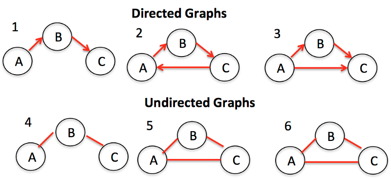

# Граф

**Графы** представляют собой совокупности узлов (также называемых вершинами) и связей (называемых ребрами) между ними. Графы также известны как сети.

Одним из примеров графов является социальная сеть. Узлы - это люди, а ребра - дружба.



Существует два основных типа графов: ориентированные и неориентированные. Второй тип - это графы без какого-либо направления на ребрах между узлами. Ориентированные графы, напротив, представляют собой графы с направлением на них.

Два частых способа представления графа - это список смежности и матрица смежности.


Список смежности может быть представлен как список, где левая сторона является узлом, а правая - списком всех других узлов, с которыми он соединен.

Матрица смежности представляет собой таблицу чисел, где каждая строка или столбец представляет собой другой узел на графе. На пересечении строки и столбца есть число, которое указывает на отношение. Нули означают, что нет ребер или отношений. Единицы означают, что есть отношения. Числа выше единицы могут использоваться для отображения разных весов.

Алгоритмы обхода - это алгоритмы для перемещения или посещения узлов в графе. Основными типами алгоритмов обхода являются поиск в ширину и поиск в глубину. Одно из применений заключается в определении того, насколько близко узлы расположены по отношению к корневому узлу. Посмотрите, как реализовать поиск по ширине в JavaScript в приведенном ниже видео.

```js
/* Graphs: Breadth-first search */

function bfs(graph, root) {
  var nodesLen = {};

  for (var i = 0; i < graph.length; i++) {
    nodesLen[i] = Infinity;
  }
  nodesLen[root] = 0;

  var queue = [root];
  var current;

  while (queue.length != 0) {
    current = queue.shift();

    var curConnected = graph[current];
    var neighborIdx = [];
    var idx = curConnected.indexOf(1);
    while (idx != -1) {
      neighborIdx.push(idx);
      idx = curConnected.indexOf(1, idx + 1);
    }

    for (var j = 0; j < neighborIdx.length; j++) {
      if (nodesLen[neighborIdx[j]] == Infinity) {
        nodesLen[neighborIdx[j]] = nodesLen[current] + 1;
        queue.push(neighborIdx[j]);
      }
    }
  }
  return nodesLen;
}

var exBFSGraph = [
  [0, 1, 1, 1, 0],
  [0, 0, 1, 0, 0],
  [1, 1, 0, 0, 0],
  [0, 0, 0, 1, 0],
  [0, 1, 0, 0, 0],
];
console.log(bfs(exBFSGraph, 1));
```
