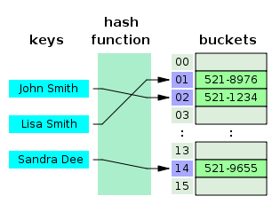

# Хэш-таблица

**Хэш-таблица** - это структура данных, реализующая интерфейс map, который позволяет хранить пары ключ / значение. Она использует хеш-функцию для вычисления индекса в массиве, по которым можно найти желаемое значение.



Хеш-функция обычно принимает строку и возвращает числовое значение. Хеш-функция всегда должна возвращать одинаковое число для одного и того же ввода. Когда два ввода хешируются с одним и тем же цифровым выходом, это коллизия. Суть в том, чтобы их было как можно меньше.

Поэтому, когда вы вводите пару ключ / значение в хеш-таблице, ключ проходит через хеш-функцию и превращается в число. Это числовое значение затем используется в качестве фактического ключа, в котором значение хранится. Когда вы снова попытаетесь получить доступ к тому же ключу, хеширующая функция обработает ключ и вернет тот же числовой результат. Затем число будет использовано для поиска связанного значения. Это обеспечивает очень эффективное время поиска O(1) в среднем.

```js
var hash = (string, max) => {
  var hash = 0;
  for (var i = 0; i < string.length; i++) {
    hash += string.charCodeAt(i);
  }
  return hash % max;
};

let HashTable = function () {
  let storage = [];
  const storageLimit = 14;

  this.print = function () {
    console.log(storage);
  };

  this.add = function (key, value) {
    var index = hash(key, storageLimit);
    if (storage[index] === undefined) {
      storage[index] = [[key, value]];
    } else {
      var inserted = false;
      for (var i = 0; i < storage[index].length; i++) {
        if (storage[index][i][0] === key) {
          storage[index][i][1] = value;
          inserted = true;
        }
      }
      if (inserted === false) {
        storage[index].push([key, value]);
      }
    }
  };

  this.remove = function (key) {
    var index = hash(key, storageLimit);
    if (
      storage[index].length === 1 &&
      storage[index][0][0] === key
    ) {
      delete storage[index];
    } else {
      for (var i = 0; i < storage[index].length; i++) {
        if (storage[index][i][0] === key) {
          delete storage[index][i];
        }
      }
    }
  };

  this.lookup = function (key) {
    var index = hash(key, storageLimit);
    if (storage[index] === undefined) {
      return undefined;
    } else {
      for (var i = 0; i < storage[index].length; i++) {
        if (storage[index][i][0] === key) {
          return storage[index][i][1];
        }
      }
    }
  };
};

console.log(hash('quincy', 10));

let ht = new HashTable();
ht.add('beau', 'person');
ht.add('fido', 'dog');
ht.add('rex', 'dinosour');
ht.add('tux', 'penguin');
console.log(ht.lookup('tux'));
ht.print();
```
