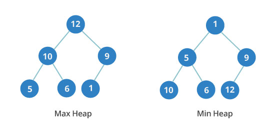

# Двоичная куча



**Двоичная куча** - это очередное дерево, в каждом узле которого не более двух детей. Кроме того, это полное дерево. Это означает, что все уровни полностью заполнены до последнего уровня, а последний уровень заполняется слева направо.

Двоичная куча может быть либо минимальной, либо максимальной. В максимальной - ключи родительских узлов всегда больше или равны тем, что у детей. В минимальной - ключи родительских узлов меньше или равны ключам дочерних элементов.

Важен порядок между уровнями, но не узлами на одном уровне. На изображении вы можете видеть, что третий уровень минимальной кучи имеет значения 10, 6 и 12. Они расположены не по порядку.

```js
/* Heaps */

// left child: i * 2
// right child: i * 2 + 1
// parent: i / 2

let MinHeap = function () {
  let heap = [null];

  this.insert = function (num) {
    heap.push(num);
    if (heap.length > 2) {
      let idx = heap.length - 1;
      while (heap[idx] < heap[Math.floor(idx / 2)]) {
        if (idx >= 1) {
          [heap[Math.floor(idx / 2)], heap[idx]] = [
            heap[idx],
            heap[Math.floor(idx / 2)],
          ];
          if (Math.floor(idx / 2) > 1) {
            idx = Math.floor(idx / 2);
          } else {
            break;
          }
        }
      }
    }
  };

  this.remove = function () {
    let smallest = heap[1];
    if (heap.length > 2) {
      heap[1] = heap[heap.length - 1];
      heap.splice(heap.length - 1);
      if (heap.length == 3) {
        if (heap[1] > heap[2]) {
          [heap[1], heap[2]] = [heap[2], heap[1]];
        }
        return smallest;
      }
      let i = 1;
      let left = 2 * i;
      let right = 2 * i + 1;
      while (
        heap[i] >= heap[left] ||
        heap[i] >= heap[right]
      ) {
        if (heap[left] < heap[right]) {
          [heap[i], heap[left]] = [heap[left], heap[i]];
          i = 2 * i;
        } else {
          [heap[i], heap[right]] = [heap[right], heap[i]];
          i = 2 * i + 1;
        }
        left = 2 * i;
        right = 2 * i + 1;
        if (
          heap[left] == undefined ||
          heap[right] == undefined
        ) {
          break;
        }
      }
    } else if (heap.length == 2) {
      heap.splice(1, 1);
    } else {
      return null;
    }
    return smallest;
  };

  this.sort = function () {
    let result = new Array();
    while (heap.length > 1) {
      result.push(this.remove());
    }
    return result;
  };
};

let MaxHeap = function () {
  let heap = [null];

  this.print = () => heap;

  this.insert = function (num) {
    heap.push(num);
    if (heap.length > 2) {
      let idx = heap.length - 1;
      while (heap[idx] > heap[Math.floor(idx / 2)]) {
        if (idx >= 1) {
          [heap[Math.floor(idx / 2)], heap[idx]] = [
            heap[idx],
            heap[Math.floor(idx / 2)],
          ];
          if (Math.floor(idx / 2) > 1) {
            idx = Math.floor(idx / 2);
          } else {
            break;
          }
        }
      }
    }
  };

  this.remove = function () {
    let smallest = heap[1];
    if (heap.length > 2) {
      heap[1] = heap[heap.length - 1];
      heap.splice(heap.length - 1);
      if (heap.length == 3) {
        if (heap[1] < heap[2]) {
          [heap[1], heap[2]] = [heap[2], heap[1]];
        }
        return smallest;
      }
      let i = 1;
      let left = 2 * i;
      let right = 2 * i + 1;
      while (
        heap[i] <= heap[left] ||
        heap[i] <= heap[right]
      ) {
        if (heap[left] > heap[right]) {
          [heap[i], heap[left]] = [heap[left], heap[i]];
          i = 2 * i;
        } else {
          [heap[i], heap[right]] = [heap[right], heap[i]];
          i = 2 * i + 1;
        }
        left = 2 * i;
        right = 2 * i + 1;
        if (
          heap[left] == undefined ||
          heap[right] == undefined
        ) {
          break;
        }
      }
    } else if (heap.length == 2) {
      heap.splice(1, 1);
    } else {
      return null;
    }
    return smallest;
  };
};
```
