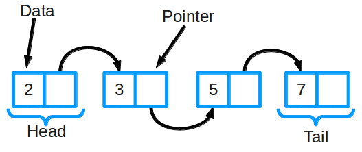

# Связный список

**Связный список** является одной из самых основных структур данных. Его часто сравнивают с массивом, поскольку многие другие структуры данных могут быть реализованы либо с помощью массива, либо с помощью связного списка. У каждого из них есть свои преимущества и недостатки.



Связный список состоит из группы узлов, которые вместе представляют последовательность. Каждый узел содержит две вещи: фактические данные, которые хранятся (которые могут быть представлены любым типом данных), и указатель (или ссылка) на следующий узел в последовательности. Существуют также дважды связанные списки, в которых каждый узел имеет указатель и на следующий, и на предыдущий элемент в списке.

Самые основные операции в связанном списке включают добавление элемента в список, удаление элемента из списка и поиск в списке для элемента.

Пример реализации связанного списка:

```js
function LinkedList() {
  var length = 0;
  var head = null;

  var Node = function (element) {
    this.element = element;
    this.next = null;
  };

  this.size = function () {
    return length;
  };

  this.head = function () {
    return head;
  };

  this.add = function (element) {
    var node = new Node(element);
    if (head === null) {
      head = node;
    } else {
      var currentNode = head;

      while (currentNode.next) {
        currentNode = currentNode.next;
      }

      currentNode.next = node;
    }

    length++;
  };

  this.remove = function (element) {
    var currentNode = head;
    var previousNode;
    if (currentNode.element === element) {
      head = currentNode.next;
    } else {
      while (currentNode.element !== element) {
        previousNode = currentNode;
        currentNode = currentNode.next;
      }

      previousNode.next = currentNode.next;
    }

    length--;
  };

  this.isEmpty = function () {
    return length === 0;
  };

  this.indexOf = function (element) {
    var currentNode = head;
    var index = -1;

    while (currentNode) {
      index++;
      if (currentNode.element === element) {
        return index;
      }
      currentNode = currentNode.next;
    }

    return -1;
  };

  this.elementAt = function (index) {
    var currentNode = head;
    var count = 0;
    while (count < index) {
      count++;
      currentNode = currentNode.next;
    }
    return currentNode.element;
  };

  this.addAt = function (index, element) {
    var node = new Node(element);

    var currentNode = head;
    var previousNode;
    var currentIndex = 0;

    if (index > length) {
      return false;
    }

    if (index === 0) {
      node.next = currentNode;
      head = node;
    } else {
      while (currentIndex < index) {
        currentIndex++;
        previousNode = currentNode;
        currentNode = currentNode.next;
      }
      node.next = currentNode;
      previousNode.next = node;
    }
    length++;
  };

  this.removeAt = function (index) {
    var currentNode = head;
    var previousNode;
    var currentIndex = 0;
    if (index < 0 || index >= length) {
      return null;
    }
    if (index === 0) {
      head = currentNode.next;
    } else {
      while (currentIndex < index) {
        currentIndex++;
        previousNode = currentNode;
        currentNode = currentNode.next;
      }
      previousNode.next = currentNode.next;
    }
    length--;
    return currentNode.element;
  };
}

var conga = new LinkedList();
conga.add('Kitten');
conga.add('Puppy');
conga.add('Dog');
conga.add('Cat');
conga.add('Fish');
console.log(conga.size());
console.log(conga.removeAt(3));
console.log(conga.elementAt(3));
console.log(conga.indexOf('Puppy'));
console.log(conga.size());
```
