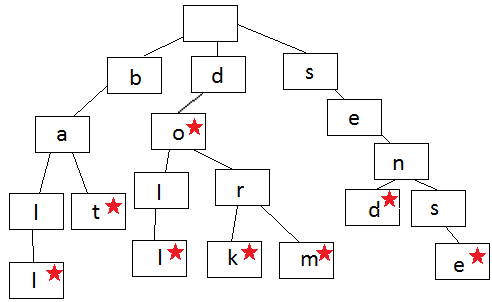

# Префиксное дерево

**Бор, луч или дерево префикса** - это своего рода дерево поиска. Оно хранит данные в шагах, каждый из которых является его узлом. Префиксное дерево из-за быстрого поиска и функции автоматического дописания часто используют для хранения слов.



Каждый узел в префиксном дереве содержит одну букву слова. Вы следуете ветвям дерева, чтобы записать слово, по одной букве за раз. Шаги начинают расходиться, когда порядок букв отличается от других слов в дереве или, когда заканчивается слово. Каждый узел содержит букву (данные) и логическое значение, указывающее, является ли узел последним узлом в слове.

Посмотрите на изображение, и вы можете создавать слова. Всегда начинайте с корневого узла вверху и двигайтесь вниз. Показанное здесь дерево содержит слово ball, bat, doll, do, dork, dorm, send, sense.

```js
let Node = function () {
  this.keys = new Map();
  this.end = false;
  this.setEnd = function () {
    this.end = true;
  };
  this.isEnd = function () {
    return this.end;
  };
};

let Trie = function () {
  this.root = new Node();

  this.add = function (input, node = this.root) {
    if (input.length == 0) {
      node.setEnd();
      return;
    } else if (!node.keys.has(input[0])) {
      node.keys.set(input[0], new Node());
      return this.add(
        input.substr(1),
        node.keys.get(input[0])
      );
    } else {
      return this.add(
        input.substr(1),
        node.keys.get(input[0])
      );
    }
  };

  this.isWord = function (word) {
    let node = this.root;
    while (word.length > 1) {
      if (!node.keys.has(word[0])) {
        return false;
      } else {
        node = node.keys.get(word[0]);
        word = word.substr(1);
      }
    }
    return node.keys.has(word) &&
      node.keys.get(word).isEnd()
      ? true
      : false;
  };

  this.print = function () {
    let words = new Array();
    let search = function (node, string) {
      if (node.keys.size != 0) {
        for (let letter of node.keys.keys()) {
          search(
            node.keys.get(letter),
            string.concat(letter)
          );
        }
        if (node.isEnd()) {
          words.push(string);
        }
      } else {
        string.length > 0 ? words.push(string) : undefined;
        return;
      }
    };
    search(this.root, new String());
    return words.length > 0 ? words : mo;
  };
};

myTrie = new Trie();
myTrie.add('ball');
myTrie.add('bat');
myTrie.add('doll');
myTrie.add('dork');
myTrie.add('do');
myTrie.add('dorm');
myTrie.add('send');
myTrie.add('sense');
console.log(myTrie.isWord('doll'));
console.log(myTrie.isWord('dor'));
console.log(myTrie.isWord('dorf'));
console.log(myTrie.print());
```
