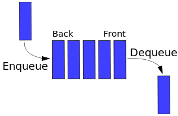

# Очередь

Вы можете думать об этой структуре, как об очереди людей в продуктовом магазине. Стоящий первым будет обслужен первым. Также как очередь.



Если рассматривать **очередь** с точки доступа к данным, то она является FIFO (First In First Out). Это означает, что после добавления нового элемента все элементы, которые были добавлены до этого, должны быть удалены до того, как новый элемент будет удален.

В очереди есть только две основные операции: `enqueue` и `dequeue`. Enqueue означает вставить элемент в конец очереди, а dequeue означает удаление переднего элемента.

```js
function Queue() {
  collection = [];
  this.print = function () {
    console.log(collection);
  };
  this.enqueue = function (element) {
    collection.push(element);
  };
  this.dequeue = function () {
    return collection.shift();
  };
  this.front = function () {
    return collection[0];
  };
  this.size = function () {
    return collection.length;
  };
  this.isEmpty = function () {
    return collection.length === 0;
  };
}

var q = new Queue();
q.enqueue('a');
q.enqueue('b');
q.enqueue('c');
q.print();
q.dequeue();
console.log(q.front());
q.print();

function PriorityQueue() {
  var collection = [];
  this.printCollection = function () {
    console.log(collection);
  };
  this.enqueue = function (element) {
    if (this.isEmpty()) {
      collection.push(element);
    } else {
      var added = false;
      for (var i = 0; i < collection.length; i++) {
        if (element[1] < collection[i][1]) {
          //checking priorities
          collection.splice(i, 0, element);
          added = true;
          break;
        }
      }
      if (!added) {
        collection.push(element);
      }
    }
  };
  this.dequeue = function () {
    var value = collection.shift();
    return value[0];
  };
  this.front = function () {
    return collection[0];
  };
  this.size = function () {
    return collection.length;
  };
  this.isEmpty = function () {
    return collection.length === 0;
  };
}

var pq = new PriorityQueue();
pq.enqueue(['Beau Carnes', 2]);
pq.enqueue(['Quincy Larson', 3]);
pq.enqueue(['Ewa Mitulska-Wójcik', 1]);
pq.enqueue(['Briana Swift', 2]);
pq.printCollection();
pq.dequeue();
console.log(pq.front());
pq.printCollection();
```
