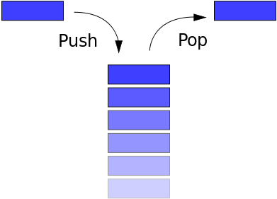

# Стек

**Стек** - это базовая структура данных, в которой вы можете только вставлять или удалять элементы в начале стека. Он напоминает стопку книг. Если вы хотите взглянуть на книгу в середине стека, вы сначала должны взять книги, лежащие сверху.

Стек считается LIFO (Last In First Out) - это означает, что последний элемент, который добавлен в стек, - это первый элемент, который из него выходит.



Существует три основных операции, которые могут выполняться в стеках: вставка элемента в стек (называемый «push»), удаление элемента из стека (называемое «pop») и отображение содержимого стека (иногда называемого «pip»).

Пример реализации стека:

```js
var letters = []; // this is our stack

var word = 'freeCodeCamp';

var rword = '';

// put letters of word into stack
for (var i = 0; i < word.length; i++) {
  letters.push(word[i]);
}

// pop off the stack in reverse order
for (var i = 0; i < word.length; i++) {
  rword += letters.pop();
}

if (rword === word) {
  console.log(word + ' is a palindrome.');
} else {
  console.log(word + ' is not a palindrome.');
}

// Creates a stack
var Stack = function () {
  this.count = 0;
  this.storage = {};

  // Adds a value onto the end of the stack
  this.push = function (value) {
    this.storage[this.count] = value;
    this.count++;
  };

  // Removes and returns the value at the end of the stack
  this.pop = function () {
    if (this.count === 0) {
      return undefined;
    }

    this.count--;
    var result = this.storage[this.count];
    delete this.storage[this.count];
    return result;
  };

  this.size = function () {
    return this.count;
  };

  // Returns the value at the end of the stack
  this.peek = function () {
    return this.storage[this.count - 1];
  };
};

var myStack = new Stack();

myStack.push(1);
myStack.push(2);
console.log(myStack.peek());
console.log(myStack.pop());
console.log(myStack.peek());
myStack.push('freeCodeCamp');
console.log(myStack.size());
console.log(myStack.peek());
console.log(myStack.pop());
console.log(myStack.peek());
```
